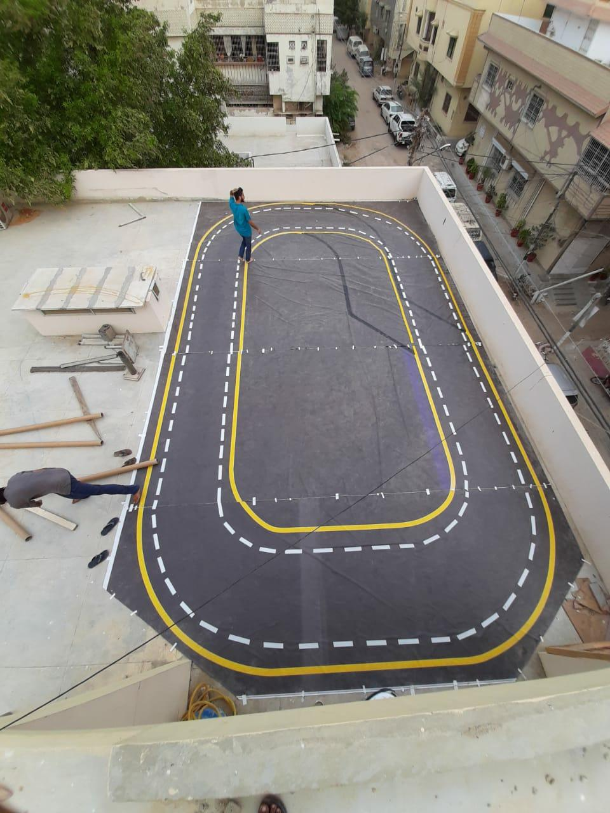
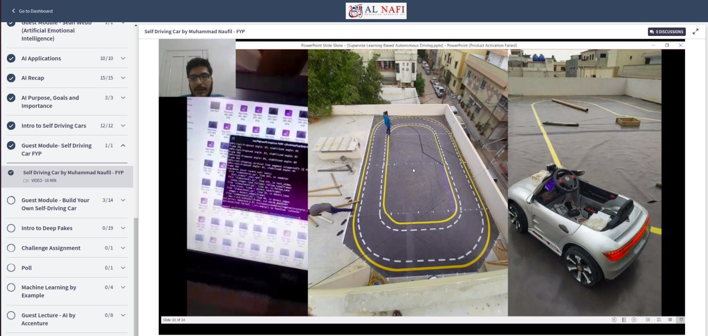

# self-driving-car-fyp
Bachelor thesis, training code and report on self-driving-car

Demo Video [here](https://www.linkedin.com/posts/mnauf_fyp-selfdrivingcar-tesla-activity-6722547508100272128-STbD?utm_source=share&utm_medium=member_desktop)

I am excited to share that that my self-driving car video lecture has become a part of "Foundations of Artificial Intelligence" course by instructor Zeeshan-ul-hassan Usmani from Alnafi Online Education.

This is a 16-minute video lecture where I have explained my final year project journey of self-driving cars and discussed the most asked question of juniors "How to select FYP".
